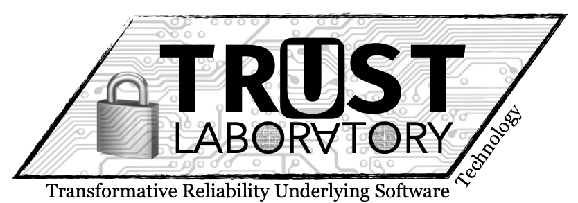

Research group focused on Formal Methods, Programming Languages, and	Software Development

# Projects

# People

- [Nadeem Abdul Hamid](https://cs.berry.edu/~nhamid), Associate Professor
- [Matthew Bowker](https://www.linkedin.com/in/matthew-bowker-283ab7221/), Undergraduate Research Assistant
- [Jessica Herring](https://www.linkedin.com/in/jessica-g-herring/), Undergraduate Research Assistant
- [Bernny Velasquez](https://www.linkedin.com/in/bernny-velasquez-062a86244/), Undergraduate Research Assistant

# Publications

